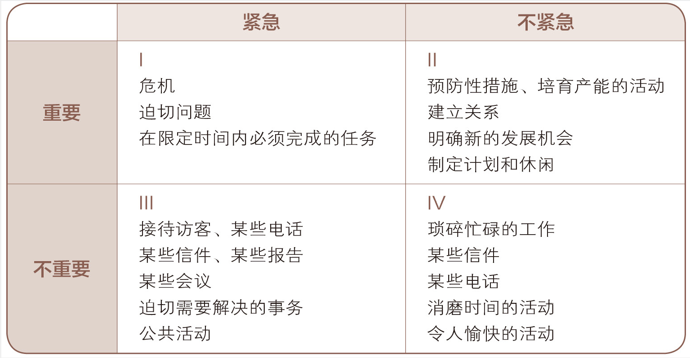

# 学习笔记

## 何为自驱力的不足

先来说说我自己这五个礼拜的状态。从第 1、2 个礼拜认真完成作业，到第 3 个礼拜在礼拜天晚上才开始做作业，最后的结果却是拖延过了 12 点，然后干脆就不做了，带着强烈的自我愧疚感，对自己安慰到“没事，下个礼拜再认真做，补上就好了”。结果却是，第四个礼拜也是没有完成作业。

或许我可以简单地将发生在自己身上的这种现象叫做“自驱力不足”，然后就是不断地给自己立 flag 和定目标，不断地打鸡血，但经验告诉我，这不可行。

这种现象让我联想起了以前在大学时的状态，每次都是在 deadline 前几天才开始赶 assignment。然后每次累死地在最后一天晚上做完之后，又给自己狂打鸡血，暗暗发誓，下回一定要 assignment 出来之后就第一时间去做，结果就又是重复上一回的结果，反反复复。

后面我就开始研究自己的这一个现象，还专门写了一篇文章[《知行合一》](https://mp.weixin.qq.com/s/rSX4MtaHt_8cB1KkYYLXRw) ，探讨这个问题。我在文章中，利用“知行合一”这个概念来阐述一个原理，那便是如果我们对于完成某件事情带来的好处，以及不完成这件事带来的坏处没有浸入身体的认知的话，那么就没有所谓的自驱力。
我引用一下文章中的一个片段：

> “知行合一”其实本质上否定了“意志薄弱”这种现象，或者说认为其只是一个假象。我曾经听过这么一个例子：
> NBA 为了训练新球员面对新的身份和新的名声，特别提醒球员小心女球迷。有一次在生理知识理论课程结束之后，球员们放假回家。这些身体健硕又多金的球员在路边、在餐厅、在酒吧都有身材火辣的女球迷投怀送抱，他们相互留了电话，随时准备一场约会。周一球员们返回训练中心，他们惊讶地发现，前台站着一排漂亮女孩，都是他们周末遇见过的。她们分别自我介绍说：
> 嗨，你好！
> 我是珍妮弗，艾滋病病原携带者。
> 嗨！
> 我是露娜，艾滋病染病三年。
> 嗨！
> 我是乔琪，艾滋病病原携带者。
> 这些球员一个个倒吸了口凉气“天哪！太可怕了！这让我太意外了！”

所谓自驱力不足，或者意志薄弱，其实来源于我们没有调动起自己底层的恐惧或者看见希望时的那种情绪。我其实早就知道了一些方法，但是又惊讶，自己在这次的训练营中没有进行实践，不过所幸还不算晚，越实践越熟练。方法如下：

1. 在开始做事情前，先为这件事赋予重大意义。
2. 思考如果不做这件事，会有哪些负面意义。
3. 通过社交进行学习。

第一个方法，就是调动我们底层那种看见希望的兴奋感，而且赋予的意义越具象，我们越能感觉到兴奋。第二个方法则是调用我们底层的恐惧。第三个方法则是利用我们是社交动物这一个特性，在社交中完成某件事，可以带给我们最强烈的成就感。而自己这次放的错误就是没有给这三个方法指定具体的指标和方式。所以正好通过这篇文章，把这三个方法具象化：

### 为完成前端训练营赋予重大意义

1. 对于前端工程有更加系统性的理解。
2. 认识到更多的前端工程师，并且如果同为毕业生，那么就是同一期的战友，这是一段相当不错的社交网络。
3. 增加自己的竞争力。

### 完不成前端训练营带来的负面意义

1. 浪费接近 2000 元的学费。
2. 自己将失去认识一些优秀人才的机会，并且因为没完成学业，甚至会造成自己的信用问题。
3. 不进则退，这五个月的时间可能就浪费了，自己的竞争力下降。

### 通过社交学习

1. 加入 leetcode 打卡群
2. 找同在上海的伙伴一起在周末出去学习

## 将目标指标化

如果说上面讲的是，将达成目标的意义具象话，那么将一个目标制定为具体的指标和拆解成一定的步骤也是必不可少的，这点更考验我们的实践功力。

其实在课程的《毕业标准与奖学金》中已经清楚地阐述了毕业标准的指标：

1. 完成课程中 80% 的视频观看；
2. 完成课程中 80% 的小节练习作业；
3. 完成并提交 80% 的代码 / 项目作业；
4. 完成并提交至少 3 篇学习总结

但是这些指标依然不够具体，我举个例子你就明白了，第一条是“完成课程中 80% 的视频观看”，但是怎样算是完成了课程的观看？是打开了就可以吗，还是认真看了一遍，但是却没有记住也算看完了呢？同理，怎样算完成了小节作业，是跟着老师做一遍，还是坚持看完视频之后，完全由自己写出来算是完成练习作业呢？

最终的指标要根据你自己的程度和目标来指定，每个人都是不一样的。所以在这里我也将自己的标准列出来一下：

- 课程中的练习作业，在看完视频之后，完全理解了视频中讲的内容之后再做，而不是边看边做。并且针对每个视频都做好练习，而不是看完几个视频后，将几个视频的作业合起来做，也就是要分步骤做，让自己对课程中的内容更加熟悉。
- 每个礼拜的学习笔记中记录下每个视频教学的重点。如果有学习感悟，及时记录下来。
- 不落下一个视频
- 不落下一个课后作业
- 不落下一个学习笔记
- 每个礼拜五晚上 12 点之前完成该周任务
- 每天只花一个小时

由于我也在 leetcode 打卡群中，所以也将自己对 leetcode 的完成标准写出来一下：

- 做每道题前先自己思考，10 分钟没有结果再查看题解。
- 前 10 周，每周两道简单题和一道中等题；后 10 周，每周一道简单题，一道中等题，一道困难题。
- 每周一、三和五做题，一天一道题，时间花费不超过 1 小时。

这上面是起始目标，是针对我自己当前可行的标准。随着课程的进行，以及自己的进步，则要相应地提高自己的要求，可以要求更少的时间完成，或者对于内容完成的标准有更严苛的标准，例如做脑图或者增加额外的学习内容。

## 最后讲讲，何为“要事第一”

最近看完了《高效能人士的七个习惯》这本书，其中“要事第一”这个习惯给我留下了深刻的印象。看看这个我们熟悉的四象限。

所谓要事第一，就是要求我们将主要的精力放在第二象限，也就是“重要不紧急”的事情上。为什么，因为这样会让我们最有效率和从容。本质上如果我们把精力放在“重要但不紧急”的事情上，就是在解决未来可能会发生的问题，例如我们学习前端训练营就是为了解决未来可能导致的竞争力不足的问题，我们是在为未来投资。另一方面，如果“我们竞争力不足”是一个现在的问题，即是“重要且紧急”的事情，可能会导致你被开除，那么你就变得非常被动了。这和我们每个礼拜完成作业的方式也一样。在每个礼拜一的时候，每个礼拜的作业都是“重要不紧急”的，但是我们应当先着手去解决掉，而真当到了礼拜天，完成作业变成了“重要紧急”的事情时，我们就很被动了。

共勉！
